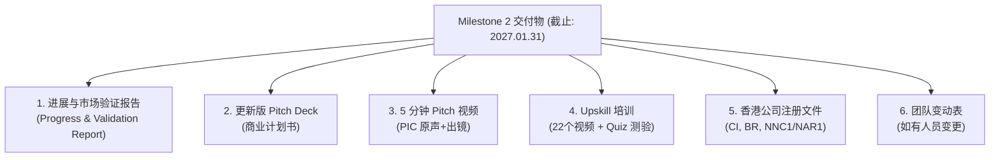
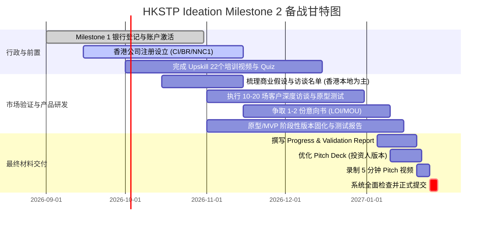

# HKSTP Ideation 计划 —— Milestone 2 (Gold Badge) 备战与交付全指南

> **适用批次**：Cohort 26-22（2026年9月批次）  
> **核心目标**：通过 Milestone 2 评审，解锁 **Gold Badge**，获得 **HK$40,000** 资助，并受邀参加 **Level-up Bootcamp**（对接进入 HKSTP Incubation 科技创业培育计划）。  
> **最终截止时间**：**2027年1月31日**（严禁逾期，逾期不予受理）

---

## 目录
- [一、 关键里程碑时间表](#一-关键里程碑时间表)
- [二、 Milestone 2 必须提交的交付物清单](#二-milestone-2-必须提交的交付物清单)
  - [1. 进展与市场验证报告 (PPT/PDF)](#1-进展与市场验证报告-pptpdf)
  - [2. 投资人版商业计划书 (Pitch Deck)](#2-投资人版商业计划书-pitch-deck)
  - [3. 5 分钟项目宣讲视频 (Pitch Video)](#3-5-分钟项目宣讲视频-pitch-video)
  - [4. Upskill 在线培训与考核测验](#4-upskill-在线培训与考核测验)
  - [5. 香港公司注册文件（个人入选者必须）](#5-香港公司注册文件个人入选者必须)
  - [6. 团队变动名单（如有变动）](#6-团队变动名单如有变动)
- [三、 官方市场验证方法论 (Market Validation Guide)](#三-官方市场验证方法论-market-validation-guide)
  - [1. 评审看重的“5 个 Why”](#1-评审看重的5-个-why)
  - [2. 调研方式优劣分析与避坑指南](#2-调研方式优劣分析与避坑指南)
  - [3. 假设构建模型 (Hypothesis Formulation)](#3-假设构建模型-hypothesis-formulation)
  - [4. 访谈核心技巧与原则（基于 The Mom Test）](#4-访谈核心技巧与原则基于-the-mom-test)
- [四、 分阶段行动规划 (2026年9月 - 2027年1月)](#四-分阶段行动规划-2026年9月---2027年1月)
- [五、 客户访谈记录表模板 (Customer Discovery Log)](#五-客户访谈记录表模板-customer-discovery-log)
- [六、 核心参考资料索引](#六-核心参考资料索引)

---

## 一、 关键里程碑时间表

| 事项 | 截止日期 / 时间点 | 说明 / 要求 |
| :--- | :--- | :--- |
| **计划正式启动** | 2026年9月1日 | 12 个月孵化周期启动 |
| **Milestone 1 截止** | **2026年11月30日** | 完成银行账户登记、激活 Upskill 培训账号、登录 PartnersConnect |
| **第一期资助发放** | 2026年10月-11月 | 发放 **HK$10,000**（银行审核通过后） |
| **Milestone 2 提交截止** | **2027年1月31日** | **硬性截止**：提交 PPT 报告、Pitch Deck、5分钟视频、培训记录等 |
| **Milestone 2 结果公布** | 2027年3月底 | 评审结果公布，合格者获邀参加 Level-up Bootcamp |
| **第二期资助发放** | 2027年4月 | 发放 **HK$40,000**（需已完成香港公司设立与资质审核） |
| **Level-up Bootcamp** | 2027年5月 - 6月 | 现场模拟路演与导师指导，争取获得 Incubation 快速通道资格 |
| **Milestone 3 申请截止** | 2027年7月31日 | 提交 HKSTP Incubation 申请（审批通过可获 **HK$50,000** 尾款） |
| **计划结项** | 2027年8月31日 | 完成结项问卷与毕业认证 |

---

## 二、 Milestone 2 必须提交的交付物清单



### 1. 进展与市场验证报告 (PPT/PDF)
使用官方标准模板：[`docs/2082719597490606081_for reference only_ideation gold badge progress report and market validation report template (v5)_overseas landing.pptx`](docs/2082719597490606081_for%20reference%20only_ideation%20gold%20badge%20progress%20report%20and%20market%20validation%20report%20template%20(v5)_overseas%20landing.pptx)。

#### Part 1: 项目进展更新 (Progress Updates)
* **核心团队 (Core Team)**：CEO 及关键团队成员的教育/行业背景、在项目中的职责分工（全职/兼职）。
* **项目总结 (Project Summary)**：原定计划 vs 目前实际取得的里程碑成果。
* **业务拓展 (Business Development)**：商务合作推进、潜在客户渠道、市场拓展进度。
* **技术研发 (Technology Development)**：技术架构、产品原型 (Prototype) 研发进度与里程碑（**计划期末必须产出可运行的原型/MVP**）。
* **企业与财务 (Corporate & Financial)**：企业发展里程碑、财务规划/现金流预测、知识产权 (IP/专利/软著)、所获荣誉奖项。

#### Part 2: 市场验证报告 (Market Validation Report)
* **香港落地要素（海外/内地团队必填）**：
  * 重点强调在香港本地开展的工作与业务进展。
  * 证明项目拓展香港市场的意愿、资源投入以及产品概念在香港目标市场的可行性。
* **目标客群与原因 (Target Customers & Why)**：明确谁是目标受众，痛点产生的具体场景。
* **客户调研反馈 (Feedback from Target Customers)**：
  * 调研方式（深度访谈、用户测试等）。
  * 收集到的第一手定性/定量反馈。
* **数据分析与洞察 (Data Analysis & Learnings)**：调研结果说明了什么？验证了什么？推翻了什么？
* **方案调整与优化 (Refine)**：根据真实市场反馈，对产品定义、功能边界或商业模式做出了哪些优化与迭代。
* **时间表与资源 (Timeline & Resources)**：后续开发/商用整体排期，以及完成项目所需的资源要素（资金、场地、人才、技术生态）。
* **成功指标 (Success Metrics)**：如何度量项目的阶段性成功（量化内部指标）。
* **合规声明 (Declaration)**：勾选声明并签字。

> **核心原则：证据为王 (Evidence rather than statements alone)**  
> 评委高度看重客观证明材料，请在 PPT 附录或提交附件中包含：
> - 客户访谈记录摘要 (Customer Discovery Logs)
> - 签署的意向书 (LOI)、合作备忘录 (MOU) 或客户试点协议
> - 产品原型/Demo 截图、用户测试录屏或测试指标数据
> - 知识产权申请回执 (IP Filings) 或发票/合同单据

---

### 2. 投资人版商业计划书 (Pitch Deck)
* **定位**：简洁精炼的商业路演 PPT（建议 10~15 页），具备直接向投资人路演的水准。
* **重点内容**：
  1. 问题与市场痛点 (Problem)
  2. 解决方案与独特价值主张 (Solution & Value Proposition)
  3. 核心技术壁垒与原型展示 (Technology & Product Prototype)
  4. 市场规模与目标受众 (TAM / SAM / SOM)
  5. 商业模式与定价策略 (Business & Revenue Model)
  6. 香港实体定位与落地规划 (Hong Kong Landing Plan)
  7. 核心团队背景 (Core Team)
  8. 融资需求与未来 12-24 个月里程碑 (Roadmap & Milestones)

---

### 3. 5 分钟项目宣讲视频 (Pitch Video)
* **时长限制**：严格控制在 **5 分钟以内**（超过 5 分钟的内容评委有权忽略不看）。
* **格式格式**：`.mp4` 或 `.mov` 文件。
* **主讲人要求**：**必须由项目负责人 (Person-In-Charge, PIC) 亲自出镜并使用原声讲解**。
* **合规红线**：**严禁使用 AI 头像（AI Avatar）或 AI 合成语音**。
* **语言**：英语、普通话或粤语均可（建议使用团队最流畅、最自信的语言）。
* **录制建议**：使用 Zoom、Microsoft Teams 或腾讯会议开启摄像头录屏，画面左侧/右上角显示 PIC 人像，主画面展示 Pitch Deck。

---

### 4. Upskill 在线培训与考核测验
* 登录培训平台（查收邮件 *“Your Entrepreneurial Journey Starts…Access HKSTP Training Videos”*，账号问题联系 `training@hkstp.org`）。
* 完成 **22 个专家视频课程**（覆盖“发现机遇”、“市场验证”、“商业规划”、“商业模式设计”四大板块）。
* 完成 **创业基础挑战测验 (Entrepreneurship Fundamentals Challenge Quiz)**。

---

### 5. 香港公司注册文件（个人入选者必须）
若初期以**个人成员 (Individual Member)** 身份入选，在 Milestone 2 必须完成香港私人股份有限公司设立，并上传以下文件：
1. **公司注册证明书 (Certificate of Incorporation, CI)**：成立日期需在申请开始日期的 2 年之内。
2. **有效商业登记证 (Business Registration Certificate, BR)**。
3. **法团成立表格 / 周年申报表 (NNC1 / NAR1 / AoA)**：**PIC 必须体现为公司正式股东**（若未在初始表格列出，须补充带有生效日期的正式股份转让文件 Transfer of Shares）。
4. **地址规范**：公司的注册商业地址**不得**使用香港科学园 (HKSTP) 或创新中心 (InnoCentre)。

---

### 6. 团队变动名单（如有变动）
* 若团队成员有新增或退出，使用官方模板 [`docs/2085629128646332416_4. ideation member list (v5.3).xlsx`](docs/2085629128646332416_4.%20ideation%20member%20list%20(v5.3).xlsx) 填写并上传。
* **注意**：项目主负责人 (PIC) 在任何情况下均不可变更。

---

## 三、 官方市场验证方法论 (Market Validation Guide)

参考官方指南 [`docs/5. How to do Idea Market Validation (for reference only).pdf`](docs/5.%20How%20to%20do%20Idea%20Market%20Validation%20(for%20reference%20only).pdf)。

### 1. 评审看重的“5 个 Why”
评审在审阅你的市场验证报告时，重点考察以下逻辑闭环：
```
1. 痛点存在的原因 (Why Problem Exists)
   └─ 2. 关注该痛点的群体规模 (Why Many People Care)
      └─ 3. 客户对你的方案感到兴奋的原因 (Why Excited About Value Prop)
         └─ 4. 反馈客观有效性的证明 (Why Feedback is Valid)
            └─ 5. 团队具备落地能力的理由 (Why You Can Launch)
```

### 2. 调研方式优劣分析与避坑指南
* **强烈推荐**：**面对面访谈 (In-person Interview)** 或 **深入视频/电话访谈 (Video/Phone Interview)**。能观察真实反应、连续追问底层逻辑。
* **官方不推荐**：**大范围问卷调查 (Questionnaires / Surveys)**。问卷存在严重的**确认偏差 (Confirmation Bias)**，且打分选择题无法反映客户在真实场景下的深层动机。
* **目标样本量**：建议完成 **10~20 家核心潜在客户/行业专家的深度访谈**，并形成结构化记录。

### 3. 假设构建模型 (Hypothesis Formulation)
官方给出的标准假设公式：
$$\text{I believe } [\text{Target Market/Audience}] \text{ will } [\text{Do this Action}] \text{ for } [\text{This Reason/Motivation}].$$

| 类型 | 劣质假设（自我感动型 ❌） | 优质假设（聚焦动机与价值 ✅） |
| :--- | :--- | :--- |
| **供给端** | “我们相信司机/供应商会使用我们的平台软件接单。” | “我们相信拥有闲散时间的车主愿意用私家车载客，以获取**更灵活的工作时间与额外收入**。” |
| **需求端** | “我们相信用户会下载并使用我们的 APP 来寻找服务。” | “我们相信经常出行的商务人士愿意使用该出行服务，以获得**从 A 到 B 无繁琐手续的高效体验**。” |

### 4. 访谈核心技巧与原则（基于 The Mom Test）
1. **倾听而非推销 (Listen & Learn, Not Pitching)**：访谈不是路演，不要推销产品功能，把 80% 的时间留给受访者讲述他们的业务与困扰。
2. **多问过去的事实，少问未来的假设**：
   - ❌ 问：“如果我们开发了这个功能，你会买吗？”（受访者往往出于礼貌回答“会”）
   - ✅ 问：“上一次遇到这个问题是在什么时候？当时你是怎么处理的？为此花了多少钱/时间？为什么现有的方案无法满足？”
3. **拥抱负面反馈 (Welcome Negative Comments)**：负面反馈是产品调整的最宝贵依据。在报告中展示“根据受访者的质疑，我们砍掉了某功能、强化了某模块”，是极具说服力的加分项。
4. **携带粗糙的 MVP 进行测试**：线框图、功能原型截图或可点击 Demo 能直观帮助受访者理解方案。

---

## 四、 分阶段行动规划 (2026年9月 - 2027年1月)



---

## 五、 客户访谈记录表模板 (Customer Discovery Log)

建议为每次访谈建立如下卡片记录，并作为报告的支撑附件：

| 字段 | 记录内容 |
| :--- | :--- |
| **受访机构/角色** | 例如：香港某物流企业 IT 负责人 / 个人从业者 |
| **访谈时间与形式** | 2026年11月XX日 / 线下会议（香港）或 Teams 视频会议 |
| **验证的假设** | 例如：“假设香港中小型仓储企业面临高昂的人工盘点成本” |
| **受访者现状与核心痛点** | 目前使用纸质+手工录入，每月底盘点耗时 3 天且错误率高达 5% |
| **对现有解决方案的不满** | 传统大型 WMS 系统采购部署成本超 50 万港币，过于沉重复杂 |
| **对本方案 MVP 的反馈** | 极度认可轻量化扫码盘点模块；但提出必须支持离线缓存同步功能 |
| **后续跟进动作** | 已加入产品早期测试名单，承诺在下月试用后商讨签署意向书 (LOI) |

---

## 六、 核心参考资料索引

本仓库内提供的官方文件可随时查阅：
* [`docs/1. HKSTP Ideation Programme Handbook (V11).pdf`](docs/1.%20HKSTP%20Ideation%20Programme%20Handbook%20(V11).pdf)：计划官方运营手册与所有权责规范
* [`docs/3. Ideation Second Milestone FAQs (V2.3).pdf`](docs/3.%20Ideation%20Second%20Milestone%20FAQs%20(V2.3).pdf)：第二阶段里程碑官方常见问题解答
* [`docs/5. How to do Idea Market Validation (for reference only).pdf`](docs/5.%20How%20to%20do%20Idea%20Market%20Validation%20(for%20reference%20only).pdf)：市场验证方法论参考课件
* [`docs/2082719597490606081_for reference only_ideation gold badge progress report and market validation report template (v5)_overseas landing.pptx`](docs/2082719597490606081_for%20reference%20only_ideation%20gold%20badge%20progress%20report%20and%20market%20validation%20report%20template%20(v5)_overseas%20landing.pptx)：进度与市场验证官方 PPT 模板
* [`docs/2085629128646332416_4. ideation member list (v5.3).xlsx`](docs/2085629128646332416_4.%20ideation%20member%20list%20(v5.3).xlsx)：团队成员变更表格模板
* [`docs/Ideation Orientation - Cohort 26-22.pdf`](docs/Ideation%20Orientation%20-%20Cohort%2026-22.pdf)：迎新宣讲会完整胶片（含完整时间表与生态资源说明）
