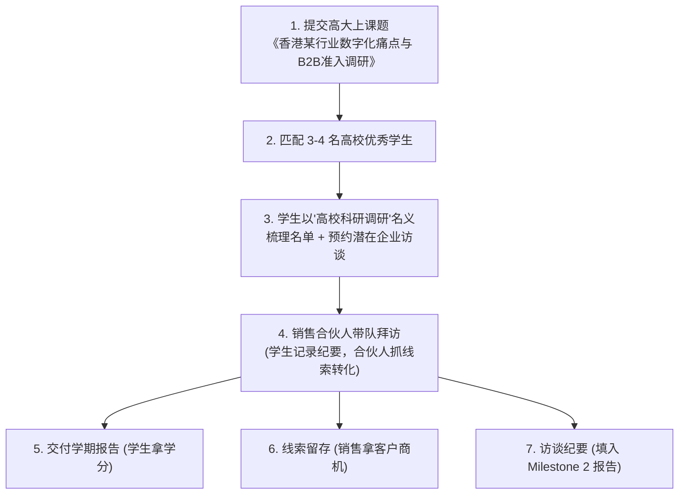

# 香港科技园 (HKSTP) 大学生项目合作与人才招募实操指南

> **核心价值**：零薪酬成本引入香港顶尖高校（港大、港科大、港中文等）本硕学生团队，协助初创企业开展 **香港本地市场调研、B2B 潜在客户发掘、竞品分析与商机拓展**，同时产出直接用于 **Milestone 2 市场验证报告** 的核心支撑证据。

---

## 目录
- [一、 核心项目：Industry Research Projects (产学研校企匹配)](#一-核心项目industry-research-projects-产学研校企匹配)
  - [1. 项目机制与“零成本”原理](#1-项目机制与零成本原理)
  - [2. 适合初创企业申报的方向](#2-适合初创企业申报的方向)
  - [3. 官方成功对标案例](#3-官方成功对标案例)
- [二、 销售合伙人“实战玩法”：如何合规调动学生跑客户](#二-销售合伙人实战玩法如何合规调动学生跑客户)
  - [1. 为什么“高校课题名义”比“纯销售推销”好用 5 倍？](#1-为什么高校课题名义比纯销售推销好用-5-倍)
  - [2. 一石三鸟的高效闭环](#2-一石三鸟的高效闭环)
- [三、 课题申报包装模板 (填报直接套用)](#三-课题申报包装模板-填报直接套用)
  - [1. 课题名称设计技巧](#1-课题名称设计技巧)
  - [2. 完整课题填报中英文模板](#2-完整课题填报中英文模板)
- [四、 招募时间表与申报流程 (每年两期)](#四-招募时间表与申报流程-每年两期)
- [五、 官方联系渠道与申请入口](#五-官方联系渠道与申请入口)
- [六、 进阶备选：香港特区政府“全额补贴薪酬”实习计划 (STEM)](#六-进阶备选香港特区政府全额补贴薪酬实习计划-stem)

---

## 一、 核心项目：Industry Research Projects (产学研校企匹配)

**Industry Research Projects** 是科技园大学合作团队（University Collaborations Team）设立的旗舰产学研项目，旨在连接园区科技企业的实际商业挑战与高校课程。

### 1. 项目机制与“零成本”原理
* **覆盖院校**：港大 (HKU)、港科大 (HKUST)、港中文 (CUHK)、城大 (CityU)、理大 (PolyU)、浸会 (HKBU) 等 **17 所香港本地及海外知名高校、77 个本硕专业**。
* **学生身份**：以修读**学分必修课（Semester Project）** 或 **毕业设计（Capstone Project / Final Year Project）** 的大学生与硕士生为主。
* **企业薪酬支出**：**HK$0 元！** 学生是为了完成课程学分、毕业要求以及丰富简历，企业**无需支付实习工资或社保**。
* **双导师体系 (Dual-Mentorship)**：
  * **学术导师 (Academic Supervisor)**：大学教授负责学术把关与学生日常督导；
  * **产业导师 (Industrial Mentor)**：由你们的销售合伙人或业务负责人担任，负责发布需求、分配任务与最终成果打分。

### 2. 适合初创企业申报的方向
官方支持三大类课题：
1. **Business & Marketing（商业与市场拓展，最适合销售合伙人）**：
   - 市场准入调研 (Market Entry Study)
   - 细分行业生态与竞品调研 (Ecosystem & Market Research)
   - 定性 B2B 客户痛点发掘 (Qualitative B2B Customer Discovery)
   - 商业模式搭建与定价分析 (Business Modelling & Pricing Strategy)
2. **Data & Technology**：系统工程、数据分析与算法测试；
3. **Creative Design**：UI/UX 设计、产品原型设计。

### 3. 官方成功对标案例
官方宣讲会第 30~31 页列举的典型案例：
* **企业**：科技园孵化企业 `EzyGreenPak Limited`（环保材料初创公司）。
* **痛点**：企业计划拓展海外市场，但缺乏本地市场情报、竞品数据和精准客户触达渠道。
* **学生交付成果**：学生小组完成了全面的行业监管标准研究、竞品定位分析，并完成了 **B2B 目标客户深度访谈与商业模式建议**。

---

## 二、 销售合伙人“实战玩法”：如何合规调动学生跑客户



### 1. 为什么“高校课题名义”比“纯销售推销”好用 5 倍？
* **传统销售痛点**：销售合伙人给香港企业打电话或发邮件推销（Cold Call），经常被前台或秘书直接拒绝，很难见到业务高管或 IT 负责人。
* **学术调研“敲门砖”**：当学生出具学生证，以**“香港科技园联合港大/科大针对某行业的数字化转型调研”**名义发出拜访邀请时，受访企业的高管非常乐意接受访谈并倾囊相授。

### 2. 一石三鸟的高效闭环
* **给学生**：完成了有大厂/科技园背书的高含金量毕业课题，拿到大学学分，表现优异者还可获得企业推荐信；
* **给销售合伙人**：获得了 100+ 香港本地目标企业线索池、与 15~20 家目标客户高管直接对话建立信任的机会，后续直接跟进商业转化；
* **给科技园 Milestone 2 评审**：产出了极具说服力的客观客户调研日志（Customer Discovery Logs）和行业分析报告，完美契合第二阶段市场验证考核要求。

---

## 三、 课题申报包装模板 (填报直接套用)

在系统提交课题时，**必须以“学术研究与市场策略”为表象，以“挖掘客户与商机”为实质**。

### 1. 课题名称设计技巧
* ❌ **反面示例**：*“某软件香港本地销售推广与客户拓展”*（会被大学教授判定为廉价劳动力而直接驳回）
* ✅ **高分示例**：*“Market Needs Validation and Strategic B2B Customer Discovery for [行业/技术领域] in Hong Kong”*

---

### 2. 完整课题填报中英文模板

```markdown
### Project Scope (课题范围)
- Primary Business Domain: Ecosystem & Market Research (行业生态与市场调研)
- Secondary Business Domain: Sales & Marketing (销售与市场拓展)

### Project Title (课题名称)
Hong Kong Market Entry Strategy & B2B Customer Discovery for [填写产品/公司名, 如: Intelligent AI Workflow Automation]

### Project Background (项目背景)
[公司名称] is an innovative technology startup incubated under the Hong Kong Science and Technology Parks (HKSTP) Ideation Programme. We have developed a state-of-the-art [产品类型，例如：AI-driven workflow automation solution]. While the underlying technology is well-established, successful commercialization in Hong Kong requires comprehensive local market intelligence, deep understanding of B2B pain points, and validation of our value proposition against local industry practices.

### Problem Statement (要解决的核心痛点)
The company lacks systematic Hong Kong local market intelligence and primary customer validation data to define an effective B2B pricing model, identify high-priority target verticals, and establish go-to-market strategies in Hong Kong.

### Problem Description (课题详细描述)
To establish a solid market foothold in Hong Kong, the project team will conduct extensive primary and secondary market research. The student team will:
1. Map out the local competitive landscape and identify underserved niche markets;
2. Build a curated database of potential enterprise clients across Hong Kong;
3. Formulate interview questions and conduct qualitative B2B customer discovery interviews with industry stakeholders;
4. Analyze customer feedback to refine product-market fit and commercial packaging.

### Expected Outcomes (学生需交付的成果物)
1. Hong Kong Market Landscape & Competitor Benchmark Matrix
2. Curated Target B2B Client Database (100+ target accounts identified)
3. Qualitative Customer Discovery Interview Logs & Summary (15-20 interviews completed)
4. Strategic Market Entry & Commercial Packaging Recommendations

### Preferable Skillsets of Students (期望学生具备的技能)
- Secondary Market Research & Analytical Frameworks
- B2B Customer Discovery & Interview Communication Skills
- Business Model Analysis & Financial Modeling (Basic)
- Professional English & Cantonese / Mandarin Communication
```

---

## 四、 招募时间表与申报流程 (每年两期)

该计划按香港大学学期制运行，每年只有 **两次招募窗口**：

| 招募轮次 | 申报时间 | 匹配学生学期 | 项目执行周期 | 当前状态 |
| :--- | :--- | :--- | :--- | :--- |
| **Round 1 (秋季学期)** | 每年 4 月 ~ 5 月 | 当年秋季学期 (Fall Semester) | 9 月 ~ 12 月 | 已截止 |
| **Round 2 (春季学期)** | **每年 10 月 ~ 11 月** | **次年春季学期 (Spring Semester)** | **次年 1 月 ~ 4 月** | **🔥 即将开放申报！** |

### 4 大操作阶段：
1. **第一步：课题提交 (10月 - 11月)**  
   初创企业在 PartnersConnect 门户或指定系统提交课题描述（套用上述模板）；
2. **第二步：学生匹配与筛选 (12月 - 1月)**  
   科技园将课题发布至 17 所高校，学生投递简历与动机信，企业进行线上/线下面试选拔；
3. **第三步：正式启动与执行 (1月 - 4月)**  
   召开 Kick-off 会议，由销售合伙人定期（通常每周 1 次半小时会议）给学生对齐进度、指导客户约谈；
4. **第四步：结项交付与评估 (4月 - 5月)**  
   学生提交完整的 PPT 调研报告与原始访谈数据，企业导师在系统完成最终评估与反馈。

---

## 五、 官方联系渠道与申请入口

* **项目官网**：[HKSTP Industry Research Projects](https://www.hkstp.org/en/programmes/startups-co-development/industry-research-projects)
* **官方专责邮箱**：`universityprojects@hkstp.org`
* **申报入口**：留意 10 月份科技园发送至 PIC 邮箱的官方招募邮件通知（eNewsletter），或登录 [PartnersConnect](https://partnersconnect.hkstp.org/) 门户查阅。

---

## 六、 进阶备选：香港特区政府“全额补贴薪酬”实习计划 (STEM)

如果销售合伙人希望学生不仅做课题调研，而是**全职坐在办公室工作（如全职电话销售、日常运营、驻场演示）**，可以申请香港创新科技署（ITC）的资助项目：

### 1. STEM 实习资助计划 (STEM Internship Scheme)
* **资助标准**：香港特区政府向每名香港高校 STEM 专业全职实习生提供每月 **约 HK$11,200 的津贴资助**（每名学生最多资助 3 个月）。
* **企业成本**：相当于**香港政府全额出钱帮你们聘请大学生全职干活**！
* **招聘发布平台**：[HKSTP Talent Job Seeker (talentjobseeker.hkstp.org)](https://talentjobseeker.hkstp.org/)。

### 2. 研究人才库 (Research Talent Hub, RTH)
* 当后续入选 Incubation 培育计划且需要招聘全职研发人才时，特区政府每月资助高额薪酬补贴：
  * 学士学位：每月补贴最高可达 HK$20,000+
  * 硕士学位：每月补贴最高可达 HK$23,000+
  * 博士学位：每月补贴最高可达 HK$32,000+
  * 最长资助期达 36 个月。
